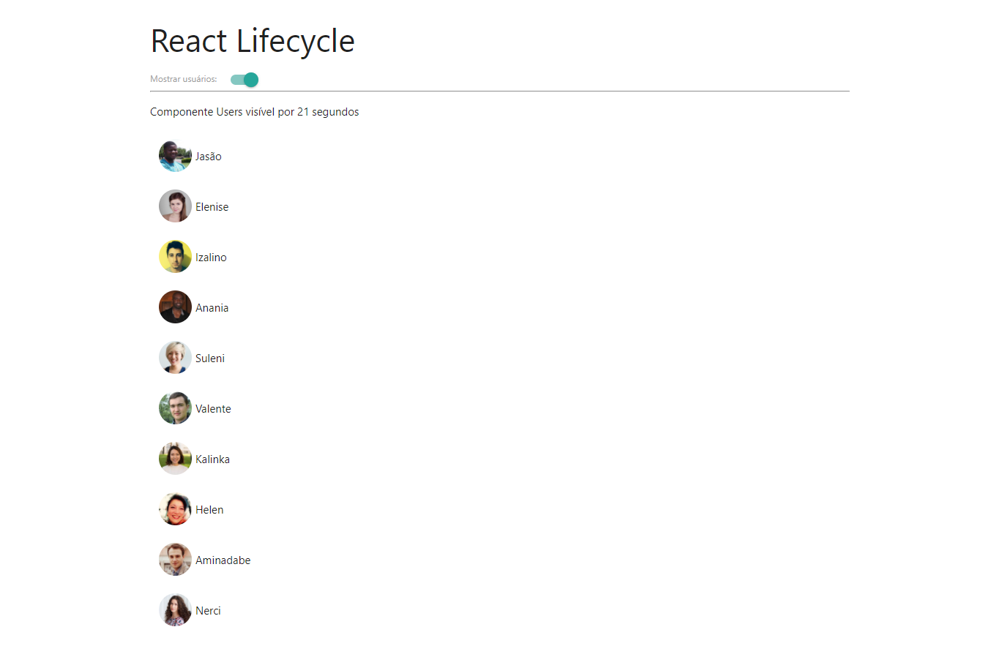

# react-show-users
A Bootacamp IGTI exercise about Class Components using  public API data from https://randomuser.me/api/?seed=rush&amp;nat=br&amp;results=10.

A Bootacamp IGTI exercise.

### get started
install dependencies</br>
```yarn```

start server</br>
```yarn start```

### Aula 07 - roteiro - ✔ 
=====================

(✔) Criar projeto a partir do projeto base.<br/>
(✔) Em App.js, colocar console.log em componentDidMount, componentDidUpdate e componentWillUnmount.<br/>
(✔) Em App.js, criar estado com um vetor de users [] e boolean showUsers false.<br/>
(✔) Em componentDidMount de App.js, preencher vetor de users com fetch de https://randomuser.me/api/?seed=rush&nat=br&results=10<br/>
(✔) No render de App.js, mostrar botão para exibir users conforme valor de showUsers.<br/>
(✔) Criar componente Users.<br/>
(✔) Listar usuários através de props de forma simples, por enquanto<br/>
(✔) Em Users.js colocar console.log em componentDidMount, componentDidUpdate e componentWillUnmount.<br/>
(✔) Em Users.js, criar estado para indicar por quantos segundos o componente está visível em tela (ex: secondsVisible: 0).<br/>
(✔) Em Users.js, criar atributo this.interval no construtor.<br/>
(✔) Em Users.js, componentDidMount, ativar interval de 1 segundo para incrementar secondsVisible.<br/>
(✔) Ao executar a aplicação, clicar no botão para esconder novamente os usuários e verificar componentWillUnmount de Users.<br/>
(✔) Corrigir erro com clearTimeout.<br/>
(✔) Estilizar app.<br/>

